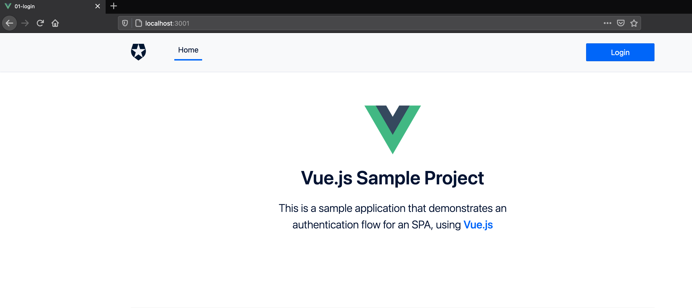
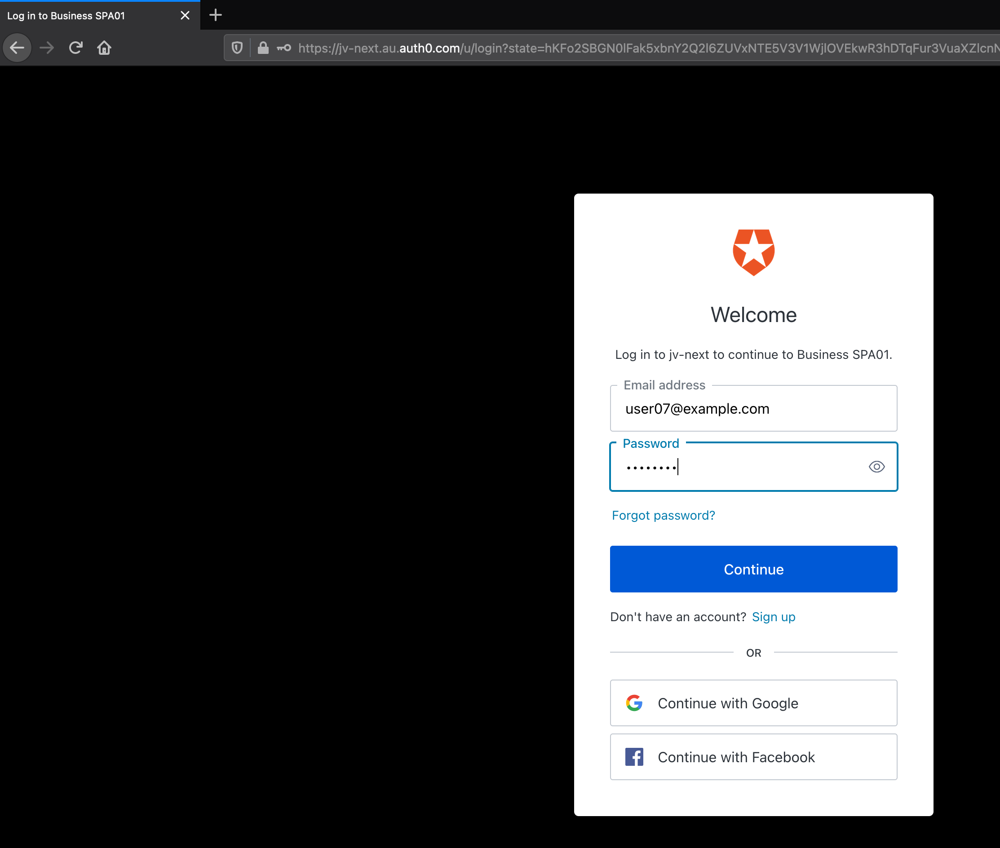
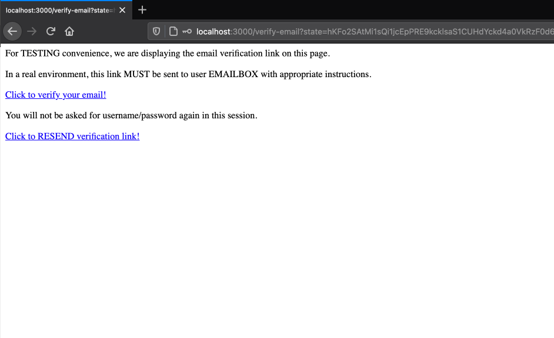
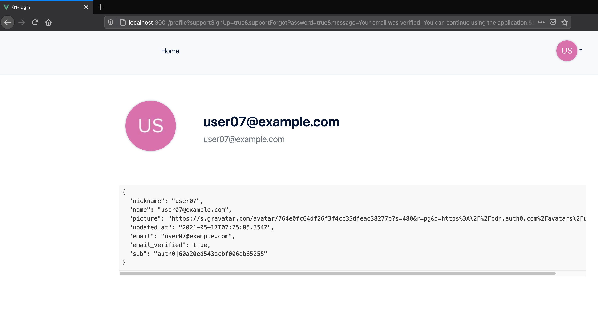

# Enforce Email Verification and Auto Login

## User Experience

### Application Splash Screen

1. User browses to app splash screen.

2. User clicks on `Login`.

### Universal Login

1. User enters credentials on `Hosted Login Page`.

### Redirect to Assistant

1. Auth0 `Rule` checks that user has **not yet verified** their `email`.

2. Rule then redirects the user to `Assistant` server-side web app.

3. User SSO to `Assistant` as they've already authenticated to `Auth0`.

4. `Assistant` identifies the user and creates and email verification ticket and sends them an email with the verification link.

5. After user clicks on the link from their email, Auth0 marks them as `email_verified = true`

### User is Authenticated to App

1. User now logs in to the appliation successfully (without entering credentials again).

2. Notice in the screenshot that the `email_verified` claim is `true`.

